## 1、连接电源和仿真器

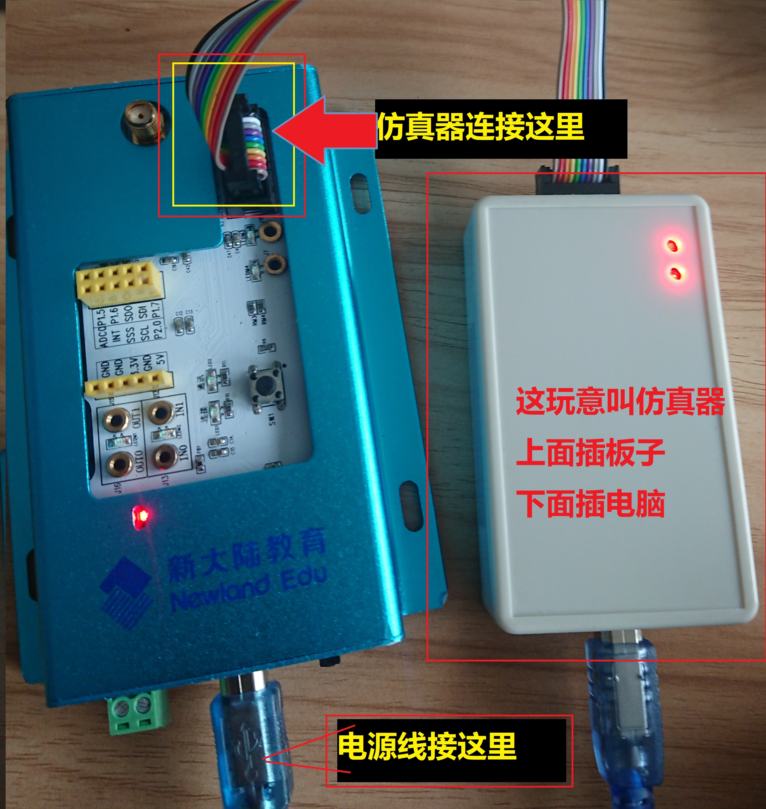

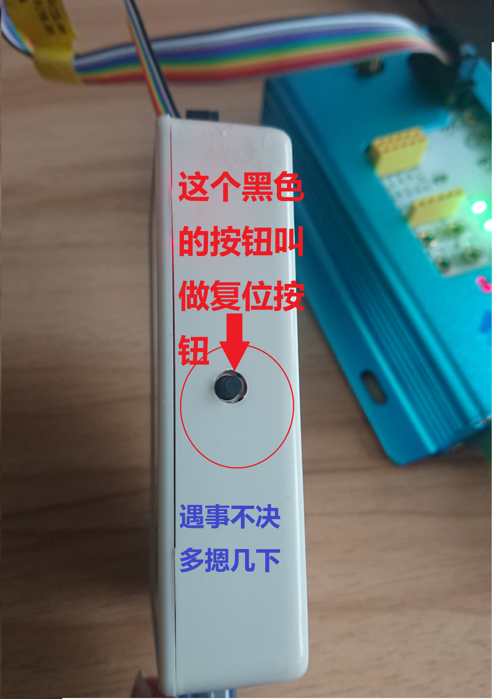

## 2、烧写传感器

### 2-1、安装 *SmartRF Flash Programmer*

软件描述
> `SmartRF Flash Programmer` 用于ZigBee开发的工具软件，利用bootloader重新给CCDebug烧录程序的专用工具，用于烧写HEX文件的工具，修复CCDebug。能自动识别CC2530系列芯片，可以实现对CC2530的Flash读写。

打开 **Setup_SmartRFProgr_1.10.2.exe**

根据软件提示完成安装：

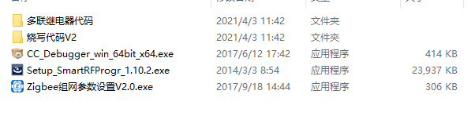

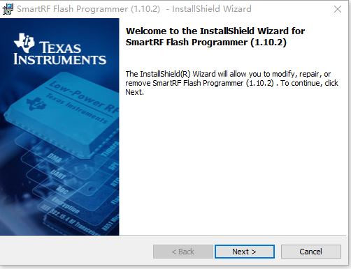

### 2-2、烧写 Zigbee 模块

软件安装完成之后，可以在桌面找到如下图标,让我们双击打开它：

打开之后就出现了以下界面：

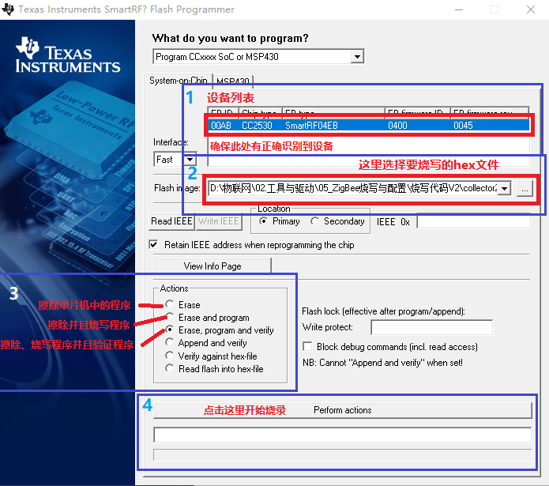

#### 2-2-1、软件的一般使用步骤

> 1、 当打开软件之后，正常情况下可以识别到设备，如果设备列表里什么也没有，**请检查单片机电源、仿真器是否完整连接**，如果都没问题，那么**请按下仿真器的复位按钮**试试吧
>
> 2、 选择要烧写的hex文件，文件的后缀是以`.hex`结尾的
>
> 3、 选择烧写的模式，如果没有其他要求的话，一般情况下我们选择第**3**项
>
> 4、 按下`Perform actions`按钮进行烧写吧

等待hex文件烧写完成
如果出现进度条上面的 **OK** 字样，恭喜你烧录成功了

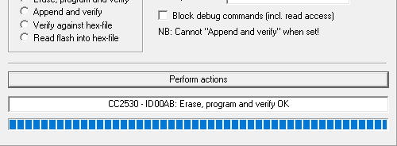

#### 2-2-2、错误的处理情况

如果你非常不幸，出现了这样的情况

那就按照以下步骤进行检查
> 1、看看软件上面的设备列表有没有检测到设备
> 2、按下仿真器上的复位按钮
> 3、有没有选择正确的 **.hex** 文件
> 4、设备有没有连接好电源，仿真器的**指示灯**亮了吗？
> 5、重新插一下设备试试
> 6、换一台电脑试试
> 7、可能是东西坏了，换一个

如果**使用以上操作均无法解决问题，属于玄学问题**

> 遇事不决，量子力学

## 3、HEX文件说明

新大陆公司给我们提供了**3**个hex文件
分别是以下3个，它们的作用如下

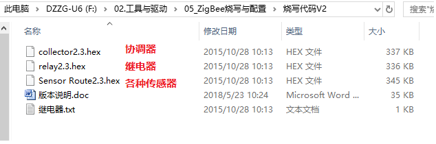

> collector.hex：协调器烧写代码 **波特率：38400**
> Sensor Route.hex：传感器 **所有的ZigBee传感器都需要烧写此文件 波特率38400**
> relay.hex：继电器烧写代码 **带串口网关功能 9600波特率,可控制LED屏**

更多信息可以查看 **版本说明.doc**

## 4、ZigBee组网

### 4-1 ZigBee 组网方式简述

ZigBee 是依靠 ZigBee 协议进行组网，那什么是ZigBee协议呢?
百科描述:
> **ZigBee** 是一项新型的无线通信技术，适用于传输范围短数据传输速率低的一系列电子元器件设备之间。 ZigBee 无线通信技术可于数以千计的微小传感器相互间，依托专门的无线电标准达成相互协调通信，因而该项技术常被称为 Home RF Lite 无线技术、FireFly 无线技术。ZigBee 无线通信技术还可应用于小范围的基于无线通信的控制及自动化等领域，可省去计算机设备、一系列数字设备相互间的有线电缆，更能够实现多种不同数字设备相互间的无线组网，使它们实现相互通信，或者接入因特网。

看不懂？没关系，ZigBee 协议比较复杂，而且现阶段我们也不需要了解这些，我们只需要了解 ZigBee 的传感器要组成网络，只需要这2个参数：

- 信道号
- PAN ID （网络标识符）

信道号通常在 11到26 之间，PAN ID 为 2 字节数字，只有信道号和 PAN ID 一致，ZigBee传感器和协调器才能组成网络，连接在一起

### 4-2 串口描述

百科描述：
> **串行接口**简称**串口**，也称**串行通信接口**或**串行通讯接口**（通常指COM接口），是采用串行通信方式的扩展接口。串行接口 （Serial Interface）是指数据一位一位地顺序传送。其特点是通信线路简单，只要一对传输线就可以实现双向通信（可以直接利用电话线作为传输线），从而大大降低了成本，特别适用于远距离通信，但传送速度较慢。
>
> 串行接口 (Serial Interface) 是指数据一位一位地顺序传送，其特点是通信线路简单，只要一对传输线就可以实现双向通信（可以直接利用电话线作为传输线），从而大大降低了成本，特别适用于远距离通信，但传送速度较慢。一条信息的各位数据被逐位按顺序传送的通讯方式称为串行通讯。串行通讯的特点是：数据位的传送，按位顺序进行，最少只需一根传输线即可完成；成本低但传送速度慢。串行通讯的距离可以从几米到几千米；根据信息的传送方向，串行通讯可以进一步分为单工、半双工和全双工三种。

我这里~~复制~~了一堆，那这玩意到底有什么用呢？

简单的说，串口就是用来**传输数据**的，比如我们的ZigBee组网，我们用串口把组网需要的信息（比如 信道号 和 PAN ID ）传输给**ZigBee单片机**，来实现组网。

### 4-3、ZigBee组网工具

首先我们打开工具，就是这货：

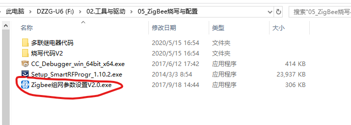

打开之后长这样
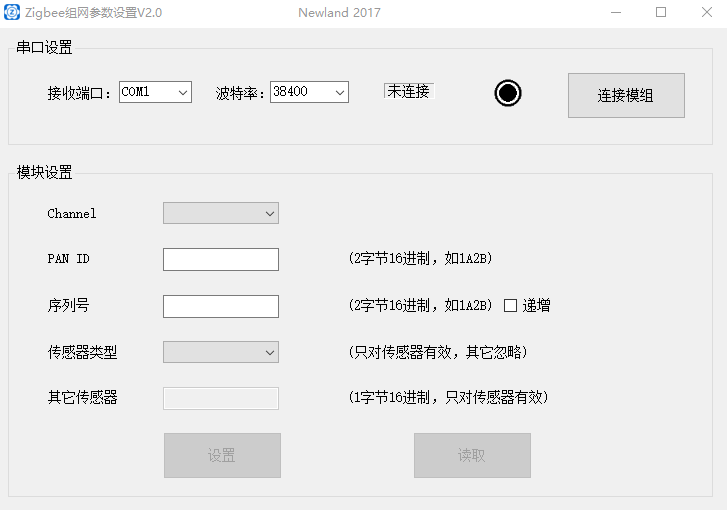

#### 4-3-1 串口的选择

通常在安装的时候，我们肯定会连接许多的串口设备，打开设备管理器的时候，一大堆COM口映入眼帘。。。。

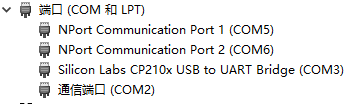

~~(这其实是算少的了，串口数量比这还要多)~~

那么，如何在这一大堆串口中，找到单片机所属的串口呢？

最简单的方法就是：
拔掉一个串口线，看看设备管理器里面哪一个串口消失了，那便是对应的串口

### 4-3-2 设置传感器参数

选择好对应的串口，波特率设置成要求的大小（第三章有说），点击**连接模组**，连接成功后设置好对应的信道号和 PAN ID 以及传感器参数，点击**设置**就完成了

### 4-4 协调器-传感器组网

首先我们拿出一个协调器，连上电源和仿真器

#### 4-4-1 协调器和仿真器连接方式

协调器是这个黑色的板子
连接方式看图

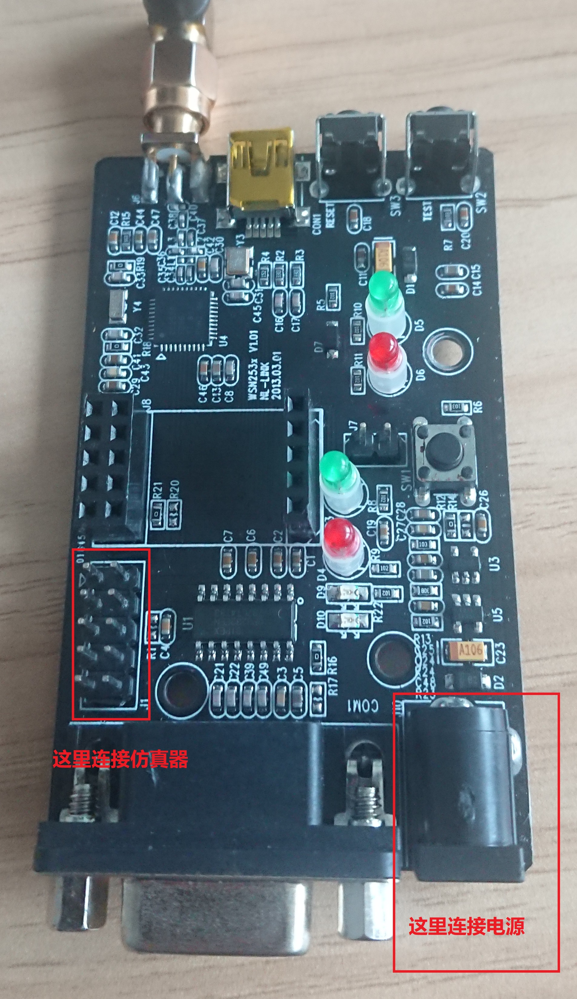

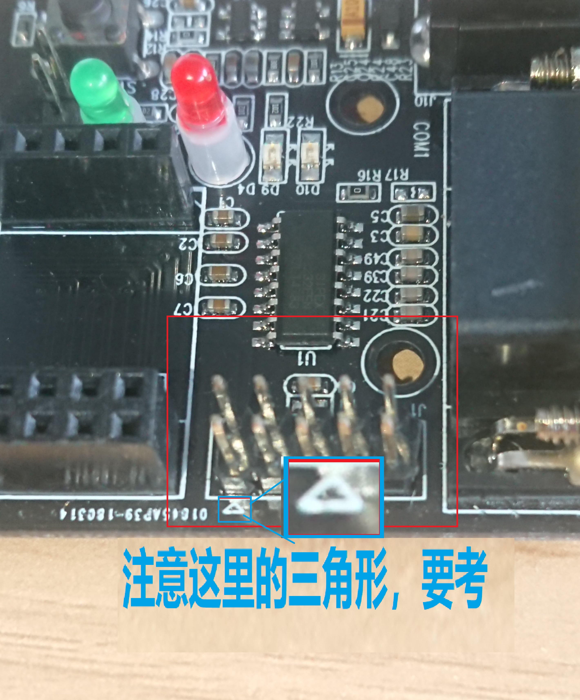

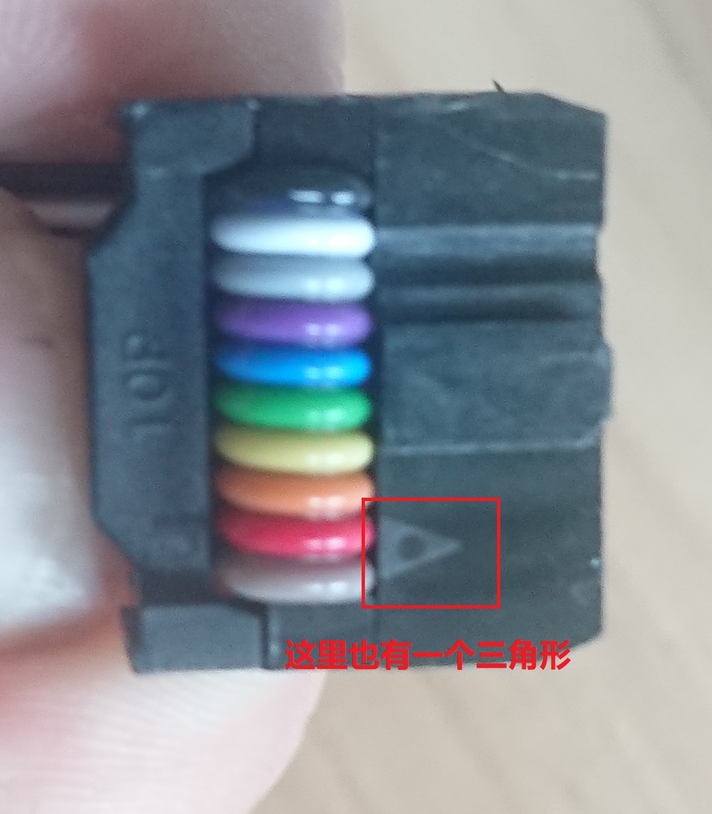

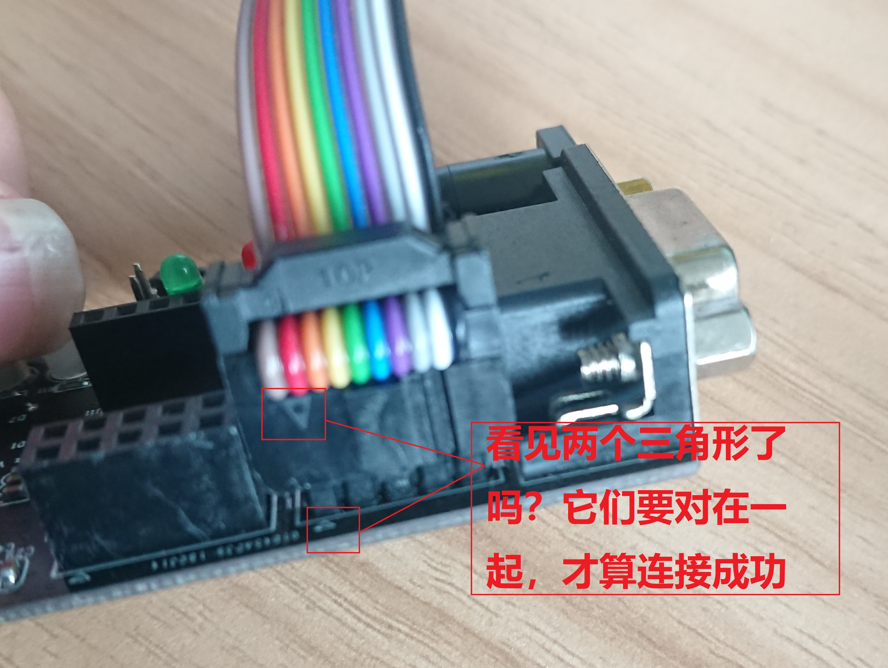

#### 4-4-2 协调器的烧写

此处略，按照 2-2 的方法烧录 `collector2.3.hex` 文件

待续。。。